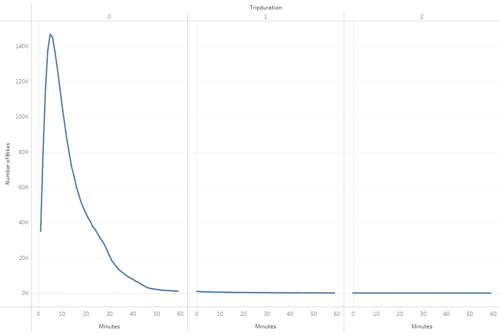
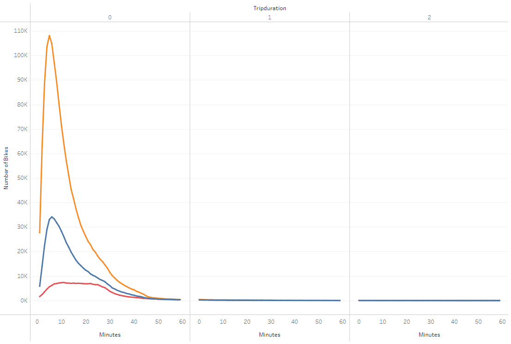
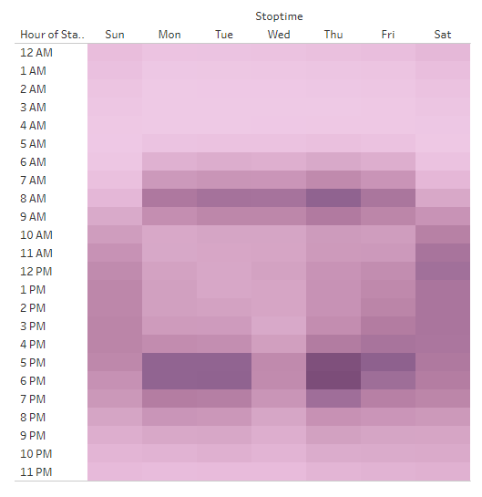
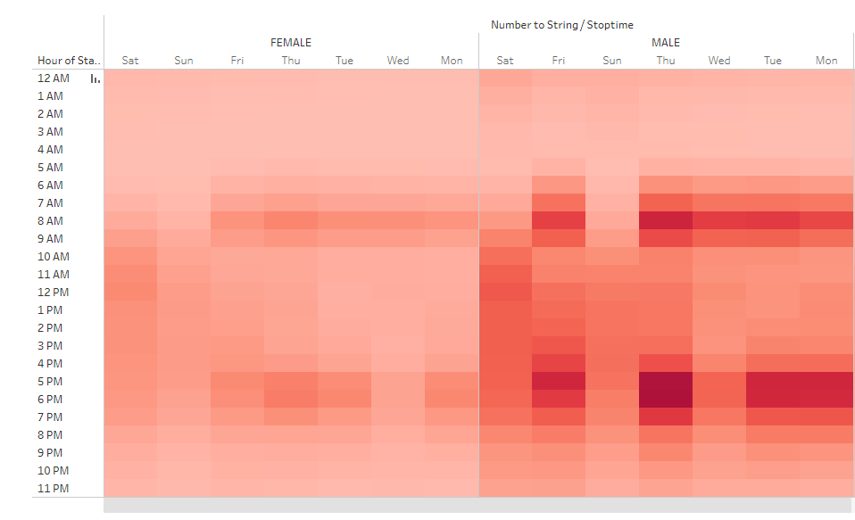
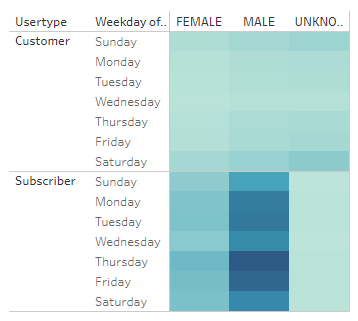
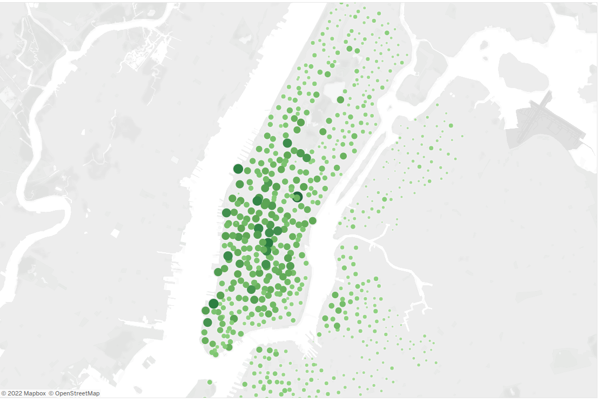
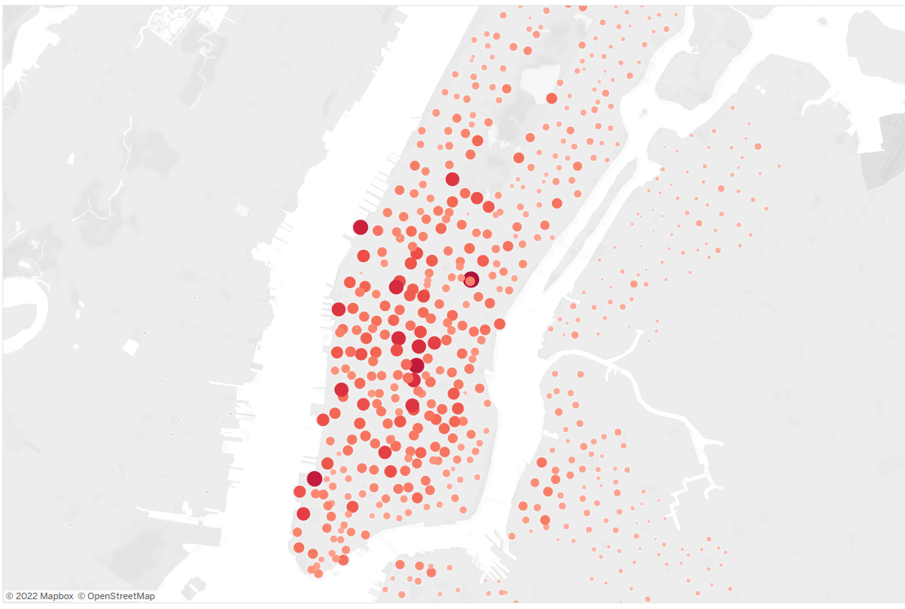

#  Analyzing CitiBike Data with Tableau
## Overview
Using the visualization power of Tableau and the New York City dataset from Citibike, analyze the bike trips from August of 2019 as support for adding bike-sharing services in new cities.

## Results
[Link to Dashboard](https://public.tableau.com/app/profile/natalie.erry/viz/Tableau-Challenge_16478142786160/BikeSharingPresentation?publish=yes)
### Checkout Times for all Users

   - Based on the results plotted above, most users utilize bike-sharing services for trips lasting between 10 and 15 minutes. 
### Checkout Time by Gender

   - Interestingly, while most users identify as male and take short trips, the users identifying as female use the bikes for longer trips. 
### Trips by Weekday per Hour

   - It appears that bikes are most widely used on the weekdays between 6 and 9 am and 5 and 7 pm, suggesting that a significant portion of users ride bicycles to commute to and from their jobs. 
### User Trips by Gender per Weekday per Hour
##### *Unknown Gender* was omitted for layout purposes.

   - Here, we can see that male-identifying users ride bikes during commuter hours more often than female-identifying users. Their usage during midday Saturday hours is also remarkably high.
### User Trips by Gender per Weekday

   - Primarily, male-identifing subscribers tend to use the bike-sharing service more than any other sub-group. Subscribers also seem more likely to identify their gender than those not suscribed. 
### Top Starting Locations

   - The spread of start locations on this map suggest that many users are moving from the outer neighborhoods into central and south Manhattan. 
### Top Ending Locations 

   - The concentration of end locations south of Central Park on the map might suggest that tourists use the bikes to reach the most popular attractions in the city.

## Summary
Summary: Provide a high-level summary of the results and two additional visualizations that you would perform with the given dataset.

Viz Suggestion 1 
Viz Suggestion 2
